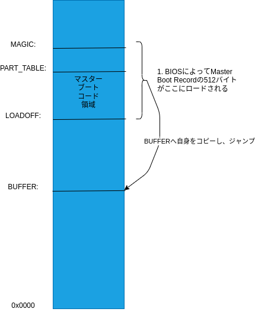
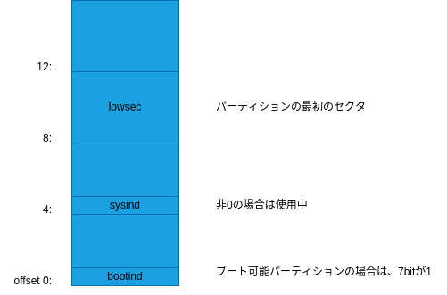
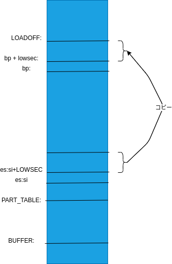

# 起動処理

MINIX 3の起動処理について述べる。

## 概要

1. BOISが、最初のセクタに510バイトのオフセットにマジックナンバー (0xAA55) を持つディスクを検索。
2. 該当のセクタがメモリのアドレスLOADOFFに読み込むされ、実行される。セクタの中身はインストール時に書き込まれたマスターブートブロックコード (masterboot.s)とディスクのパーティション情報(パーティションテーブル)である。
3. マスターブートブロックコードは自分自身のコードをアドレスBUFFERにコピーし、コピー先にジャンプする。
4. パーティションテーブルを検索してアクティブパーティションを見つけて、該当パーティションの最初のセクタを読み込む。読み込まれるのはブートストラップコード (bootblock.s)。
5. ブートストラップもアドレスLOADOFFに読み込まれるが、 マスターブートブロックとは違って自身をコピーしない。ブートストラップは、ブートモニタコード(bootファイル)をBOOTSEGにロードし、BOOTSEG:BOOTOFFに(つまり、ヘッダをスキップし)ジャンプ。ブートモニタは4つのファイル(boothead.s、boot.c、bootimage.c、rawfs.c)から構成される。
6. ブートストラップがブートモニターにジャンプした直後に、boothead.sのコードが実行される。メモリレイアウト、プロセッサ(286, 386, 486など)、現在のビデオモード、ブートされたデバイスを決定し、最後に`boot()`(boot.c)を呼び出す。Minix OSにジャンプする (必要に応じてリアルモードからプロテクトモードに切り替える) 機能もboothead.sにある。
7. `boot()`は`initialize()`(同様にboot.cにある)をコールする。`initialize()`はブートモニターを再配置し、カーネルに渡されるメモリマップからブートモニターを削除します (カーネルがブートモニターを上書きしないようにします) 。
8. `initialize()`の次に`get_parameters()`(boot.cにある)が実行され、いくつかの環境変数や関数を設定し、bootparamsセクタ (アクティブなパーティションの2番目のセクタ) からいくつかのパラメータの値を取得する。
9. 次にブートモニターはユーザーが入力したコマンドを実行する。最も重要なコマンドはboot (システムをブートする)であり、`bootminix()`(bootimage.cにある)を呼び出す。
10. `bootminix()`は以下の関数を呼び出す。
    1.  `select_image()`は、ディスク上の目的のOSイメージを検索する。
    2.  `exec_image()`は、OSイメージをメモリにロードする。
    3.  `minix()`(boothead.sで見つかる)はプロテクトモードに切り替え (カーネルがプロテクトモード向けにコンパイルされている場合) 、カーネルにジャンプする。
11. `bootminix()`は、OSからブートモニターに戻ると(たとえば、ユーザーがminix shutdownコマンドを発行した場合に)復帰する。

rawfs.cは、ファイルシステム操作の小さなサブセットである。たとえば、ディスクからブロックを読み取ったり、ファイルに関する情報を見つけたり、ディレクトリの内容を読み取ったり、パス名をiノード番号に変換したりできる。

## masterboot.s



のように、起動ディスクの最初のセクタをLOADOFFアドレスにロードし実行する。マスターブートブロックコードは自身をBUFFER領域にコピーする。アドレスの定義は以下

```Assembly
	LOADOFF	   =	0x7C00	! 0x0000:LOADOFF is where this code is loaded
	BUFFER	   =	0x0600	! First free memory
	PART_TABLE =	   446	! Location of partition table within this code
	PENTRYSIZE =	    16	! Size of one partition table entry
	MAGIC	   =	   510	! Location of the AA55 magic number
```

これから、コードを見ていきます。

```Assembly
! Find active (sub)partition, load its first sector, run it.

master:
	xor	ax, ax
	mov	ds, ax
	mov	es, ax
```

第1オペランドのレジスタ(ax)と第2オペランド(ax)とで排他的論理和をとって、第1オペランド(ax)に結果を格納します。自分自身(ax)と排他的論理和は必ずゼロになるので、axレジスタをゼロにします (それ自身とxorされた数字はすべて0です) 。これはかなり一般的なテクニックです。

```Assembly
mov ax,#0
```

だと、xorの2バイトに比べて遅く、3バイトを消費する機械語になってしまう。その後、ds, esのセグメントレジスタを0にします。

```Assembly
	cli
	mov	ss, ax			! ds = es = ss = Vector segment
	mov	sp, #LOADOFF
	sti
```

スタックセグメントレジスタ (ss) またはスタックポインター (sp) に値をmovする場合は、最初に割り込みを無効にする必要がある。ssおよびspレジスタは、割り込みが完了した後に戻るアドレスを保持する。もしssレジスタとspレジスタが変動している間に割り込まれた場合、コードが戻る場所は不定である。
割り込みはcli (clear interrupts) 命令で無効になり、sti (set interrupts) 命令で再度有効になる。

```Assembly
! Copy this code to safety, then jump to it.
	mov	si, sp			! si = start of this code
	push	si			! Also where we'll return to eventually
	mov	di, #BUFFER		! Buffer area
	mov	cx, #512/2		! One sector
	cld
  rep	movs
```

この部分は、前述の図のように、LOADOFFから512バイトをBUFFER領域にコピーします。
rep movs命令は、cxワードをds:si(これは0:LOADOFF)からes:di(これは0:BUFFER)に移動する。起動直後のシステムは16ビットPCとして(リアルモードで)起動するので1ワードは2バイトになっている。このため512/2ワードを移動する必要がある。

cld (clear direction flag) は、rep movs命令が0:LOADOFFから0:LOADFF-512までのバイトではなく、0:LOADOFFから0:LOADOFF+512までのバイトをコピーすることを指定する。前者が必要な場合は、cldの代わりにstd (set direction flag) を使用する。

```Assembly
	jmpf	BUFFER+migrate, 0	! To safety
migrate:
```

jmpf(far jump)は、セグメント0、オフセットBUFFER+migrateにジャンプする。よって、コピー先の領域にある、次の命令にジャンプすることになる。

```Assembly
findactive:
	testb	dl, dl
	jns	nextdisk		! No bootable partitions on floppies
```

BIOSは起動時にDLレジスタに起動ドライブの番号を設定する。0x00と0x01は1台目と2台目のフロッピードライブに対応し、0x80、0x81、0x82、0x83はハードディスクドライブ1~4に対応する。
testbはdl自身のビット単位の論理積をとり、signフラグを変更(負の場合に1)します。負でない場合(つまりフロッピードライブ)の場合、nextdiskへジャンプする。

```Assembly
	mov	si, #BUFFER+PART_TABLE
find:	cmpb	sysind(si), #0		! Partition type, nonzero when in use
	jz	nextpart
	testb	bootind(si), #0x80	! Active partition flag in bit 7
	jz	nextpart		! It's not active
```

パーティションテーブル(#BUFFER+PART_TABLE)を読み込んでチェックしていく。
si+sysindの値が0の場合、もしくはsi+bootindの7ビット目が立っていなければ、次のパーティションのチェックにジャンプする。

パーティションテーブルのエントリの構造は以下のようになっています。

```Assembly
	! <ibm/partition>.h:
	bootind	   =	     0
	sysind	   =	     4
	lowsec	   =	     8
```




```Assembly
loadpart:
	call	load			! Load partition bootstrap
	jc	error1			! Not supposed to fail
bootstrap:
	ret				! Jump to the master bootstrap
```

loadを呼び出して、アクティブパーティションの最初のセクタを読み込みます。

```Assembly
load:
	mov	di, #3		! Three retries for floppy spinup
retry:	push	dx		! Save drive code
	push	es
	push	di		! Next call destroys es and di
	movb	ah, #0x08	! Code for drive parameters
	int	0x13
	pop	di
	pop	es
```

[ah=0x08にセットしてint 0x13を呼び出す](https://en.wikipedia.org/wiki/INT_13H#INT_13h_AH=08h:_Read_Drive_Parameters)と、dlに指定したドライブのパラメータを返す。
バグのあるBIOSは、ES:DIを0x0000:0x0000にセットしてしまうので、es, diを予めスタックに退避して、呼び出し後に復元する。

```Assembly
	andb	cl, #0x3F	! cl = max sector number (1-origin)
	incb	dh		! dh = 1 + max head number (0-origin)
	movb	al, cl		! al = cl = sectors per track
	mulb	dh		! dh = heads, ax = heads * sectors
	mov	bx, ax		! bx = sectors per cylinder = heads * sectors
	mov	ax, lowsec+0(si)
	mov	dx, lowsec+2(si)! dx:ax = sector within drive
	cmp	dx, #[1024*255*63-255]>>16  ! Near 8G limit?
	jae	bigdisk
```

int 0x13呼び出しの結果は以下のようにレジスタがセットされる。clの5:0ビットにトラックあたりのシリンダ数、dhにヘッダの最大インデックス(0開始)がセットされる。bxにシリンダあたりのセクタ数を計算しておきます。

結果

| レジスタ | 設定値 |
| --- | --- |
| CF | エラー時にON |
| AH | 戻り値 | 
| DL | ディスクのドライブ番号 |
| DH | ヘッドの最大インデックス(0開始)  |
| CX | [7:6] [15:8] シリンダの最大インデックス(0開始)<br />[5:0] セクタ数(1開始) |
| BL | ドライブのタイプ(AT/PS2フロッピーのみ) | 
| ES:DI | ドライブパラメータ・テーブルへのポインタ(フロッピーのみ) |

dxの値で、開始位置が8GBを超えていないかをチェックして、超えていた場合はbigdiskの処理を実行する。


```Assembly
	div	bx		! ax = cylinder, dx = sector within cylinder
	xchg	ax, dx		! ax = sector within cylinder, dx = cylinder
	movb	ch, dl		! ch = low 8 bits of cylinder
	divb	cl		! al = head, ah = sector (0-origin)
	xorb	dl, dl		! About to shift bits 8-9 of cylinder into dl
	shr	dx, #1
	shr	dx, #1		! dl[6..7] = high cylinder
	orb	dl, ah		! dl[0..5] = sector (0-origin)
	movb	cl, dl		! cl[0..5] = sector, cl[6..7] = high cyl
	incb	cl		! cl[0..5] = sector (1-origin)
	pop	dx		! Restore drive code in dl
	movb	dh, al		! dh = al = head
	mov	bx, #LOADOFF	! es:bx = where sector is loaded
	mov	ax, #0x0201	! Code for read, just one sector
	int	0x13		! Call the BIOS for a read
	jmp	rdeval		! Evaluate read result
```

以下のパラメータを計算して、[ah=0x02にセットしてint 0x13を呼び出し](https://en.wikipedia.org/wiki/INT_13H#INT_13h_AH=02h:_Read_Sectors_From_Drive)て、アクティブパーティションの最初のセクタをロードする。ロード後はrdevalにジャンプして、処理を続ける。

パラメータ

| レジスタ | 設定値 |
| --- | --- |
| AL | 読み込むセクタ数 |
| CH | シリンダ番号 |
| CL | セクタ番号 |
| DH | ヘッドのインデックス |
| DL | ドライブ | 
| ES:BX | 読み出し先アドレス |

結果

| レジスタ | 設定値 |
| --- | --- |
| CF | エラー時にON |
| AH | 戻り値 | 
| AL | 実際に読み込んだセクタ数 | 

(bigdisk:は省略)

```Assembly
rdeval:
	jnc	rdok		! Read succeeded
```

エラーがなければCFフラグはクリアされてるので、エラーがなければrdokへジャンプ

```Assembly
rdok:	cmp	LOADOFF+MAGIC, #0xAA55
	jne	nosig		! Error if signature wrong
	ret			! Return with carry still clear
```

ロードしたセクタにマジックナンバーがセットされていれば、retで戻っていくことでロードしたブートストラップコード(bootblock.s)に処理を移す。

## bootblock.s

このファイルには、最終的にフロッピーディスクまたはハードディスクパーティションから読み取られるコードが含まれている。それは、ブートデバイスから/boot/bootをアドレス0x10000のメモリにロードし、それを実行するのに十分な賢さがあるだけである。/boot/bootのディスクアドレスは、installbootによって24ビットのセクター番号と、enddataより大きな8ビットのセクタ数としてこのコードにパッチされる。/boot/bootは、Minixカーネルのさまざまな部分をメモリにロードして実行し、最終的にMinixを起動するために十分に賢い。

このコードがハードドライブから始まり、マスターブートコードがこのコードを読み込んだ場合は、ブートパーティションに対応するパーティションテーブルエントリがes:siに渡される。

```Assembly
boot:
	xor	ax, ax		! ax = 0x0000, the vector segment
	mov	ds, ax
	cli			! Ignore interrupts while setting stack
	mov	ss, ax		! ss = ds = vector segment
	mov	sp, #LOADOFF	! Usual place for a bootstrap stack
	sti
```

(masterboot.sと同様に)axレジスタを0にセットし、ds, ssも0に設定する。スタックは#LOADOFFより下位に配置される。(コードよりも下位アドレスってのはちょっと馴染みがない)

```Assembly
	push	ax
	push	ax		! Push a zero lowsec(bp)

	push	dx		! Boot device in dl will be device(bp)
	mov	bp, sp		! Using var(bp) is one byte cheaper then var.
```

6バイト分だけスタック領域を確保して、変数(bp)によるアドレスでアクセスできるようにしている。用途は以下の通り。

```Assembly
	! Variables addressed using bp register
	device	   =	     0	! The boot device
	lowsec	   =	     2	! Offset of boot partition within drive
	secpcyl	   =	     6	! Sectors per cylinder = heads * sectors
```

全部で8バイト必要なのだが、6バイトしか確保しなかったので、最初の命令`xor	ax, ax`のコードが上書きされてしまう。だが、この命令は二度と実行されないので問題にはならない。まだコードセクションとかを指定していないので、コード領域に書き込んでもエラーにならない。

```Assembly
	push	es
	push	si		! es:si = partition table entry if hard disk
```

masterboot.sで設定されたパーティションテーブルのエントリのアドレスを退避。

```Assembly
	mov	di, #LOADOFF+sectors	! char *di = sectors;
```

diレジスタに、sectorデータ用のポインタをセット。(ハードディスク起動の場合、参照先のデータは後で書き換えられる)

```Assembly
	testb	dl, dl		! Winchester disks if dl >= 0x80
	jge	floppy
```

masterboot.sと同様にフロッピーからの起動かをチェックして分岐。

```Assembly
winchester:

! Get the offset of the first sector of the boot partition from the partition
! table.  The table is found at es:si, the lowsec parameter at offset LOWSEC.

	eseg
	les	ax, LOWSEC(si)	  ! es:ax = LOWSEC+2(si):LOWSEC(si)
	mov	lowsec+0(bp), ax  ! Low 16 bits of partition's first sector
	mov	lowsec+2(bp), es  ! High 16 bits of partition's first sector
```

(si)にパーティションテーブルのエントリがある。そこからLOWSECオフセットの位置にパーティションの開始アドレスがあるのでax、esレジスタに読み込む。読み込んだ値をスタックに保存する。

結局のところ、以下のようにパーティションテーブルのエントリの一部をスタックにコピーしている。




```Assembly
	movb	ah, #0x08	! Code for drive parameters
	int	0x13		! dl still contains drive
	andb	cl, #0x3F	! cl = max sector number (1-origin)
	movb	(di), cl	! Number of sectors per track
	incb	dh		! dh = 1 + max head number (0-origin)
	jmp	loadboot
```

masterboot.sと同様にディスク情報を取得。

```Assembly
loadboot:
! Load /boot from the boot device

	movb	al, (di)	! al = (di) = sectors per track
	mulb	dh		! dh = heads, ax = heads * sectors
	mov	secpcyl(bp), ax	! Sectors per cylinder = heads * sectors
```

セクタ数/シリンダを計算し、secpcyl(bp)に保存

```Assembly
	mov	ax, #BOOTSEG	! Segment to load /boot into
	mov	es, ax
	xor	bx, bx		! Load first sector at es:bx = BOOTSEG:0x0000
```

bootプログラムの読み出し先を設定。

```Assembly
	mov	si, #LOADOFF+addresses	! Start of the boot code addresses
```

installbootユーティリティによって設定される値のアドレスをセット。

```Assembly
load:
	mov	ax, 1(si)	! Get next sector number: low 16 bits
	movb	dl, 3(si)	! Bits 16-23 for your up to 8GB partition
	xorb	dh, dh		! dx:ax = sector within partition
```

bootプログラムはディスク上に分割して格納されている。addressesは、分割の単位毎にセクタ数(1バイト)、パーティション内での開始セクタ(3バイト)の4バイトのエントリがが作成される。ここでは、開始セクタをdx:axとして取得している。

```Assembly
	add	ax, lowsec+0(bp)
	adc	dx, lowsec+2(bp)! dx:ax = sector within drive
	cmp	dx, #[1024*255*63-255]>>16  ! Near 8G limit?
	jae	bigdisk
```

lowsecの情報を使って、開始セクタをパーティション内からディスクの先頭する。(8GB以上の大容量ディスクのチェックもしている)

```Assembly
	div	secpcyl(bp)	! ax = cylinder, dx = sector within cylinder
	xchg	ax, dx		! ax = sector within cylinder, dx = cylinder
	movb	ch, dl		! ch = low 8 bits of cylinder
	divb	(di)		! al = head, ah = sector (0-origin)
	xorb	dl, dl		! About to shift bits 8-9 of cylinder into dl
	shr	dx, #1
	shr	dx, #1		! dl[6..7] = high cylinder
	orb	dl, ah		! dl[0..5] = sector (0-origin)
	movb	cl, dl		! cl[0..5] = sector, cl[6..7] = high cyl
	incb	cl		! cl[0..5] = sector (1-origin)
	movb	dh, al		! dh = al = head
	movb	dl, device(bp)	! dl = device to read
	movb	al, (di)	! Sectors per track - Sector number (0-origin)
	subb	al, ah		! = Sectors left on this track
	cmpb	al, (si)	! Compare with # sectors to read
	jbe	read		! Can't read past the end of a cylinder?
	movb	al, (si)	! (si) < sectors left on this track
```

int 13呼び出しのためのパラメータを計算。トラックの最後まで読み出す必要がない場合は、(si)のセクタ数文だけ読み出す。

```Assembly
read:	push	ax		! Save al = sectors to read
	movb	ah, #0x02	! Code for disk read (all registers in use now!)
	int	0x13		! Call the BIOS for a read
	pop	cx		! Restore al in cl
	jmp	rdeval
! 略
rdeval:
	jc	error		! Jump on disk read error
	movb	al, cl		! Restore al = sectors read
	addb	bh, al		! bx += 2 * al * 256 (add bytes read)
	addb	bh, al		! es:bx = where next sector must be read
	add	1(si), ax	! Update address by sectors read
	adcb	3(si), ah	! Don't forget bits 16-23 (add ah = 0)
	subb	(si), al	! Decrement sector count by sectors read
	jnz	load		! Not all sectors have been read
	add	si, #4		! Next (address, count) pair
	cmpb	ah, (si)	! Done when no sectors to read
	jnz	load		! Read next chunk of /boot
```

int 13呼び出しでディスクを読む。読み出した結果でaddressesを更新し、続きがあるならloadをループする。

```Assembly
done:

! Call /boot, assuming a long a.out header (48 bytes).  The a.out header is
! usually short (32 bytes), but to be sure /boot has two entry points:
! One at offset 0 for the long, and one at offset 16 for the short header.
! Parameters passed in registers are:
!
!	dl	= Boot-device.
!	es:si	= Partition table entry if hard disk.
!
	pop	si		! Restore es:si = partition table entry
	pop	es		! dl is still loaded
	jmpf	BOOTOFF, BOOTSEG  ! jmp to sec. boot (skipping header).
```

読み込みが完了したら、es:siにパーティションテーブルのエントリをセットし直して、bootプログラムの(ヘッダ部分をスキップして)コード部分へジャンプ。

## boothead.s

```Assembly
	jmpf	boot, LOADSEG+3	! Set cs right (skipping long a.out header)
	.space	11		! jmpf + 11 = 16 bytes
	jmpf	boot, LOADSEG+2	! Set cs right (skipping short a.out header)
```

bootblock.sの最後で、`jmpf	BOOTOFF, BOOTSEG` によって、bootプログラムの0x30バイト目にジャンプしている。bootプログラムのヘッダ部分は、48バイト(0x30)、または、32バイト(0x20)の場合がある。48バイトのヘッダの場合は最初の`jmpf	boot, LOADSEG+3`へ、32バイトの場合は2つ目の`jmpf	boot, LOADSEG+2`に到達する。最終的には、`boot`ラベルへジャンプするようにしている。

```Assembly
boot:
	mov	ax, #LOADSEG
	mov	ds, ax		! ds = header
```

dsをヘッダの位置に設定する。

```Assembly
	movb	al, a_flags
	testb	al, #A_SEP	! Separate I&D?
	jnz	sepID
```

ヘッダ部のa_flagsを調べて条件分岐、MINIX 3のデフォルトはI&Dは分離されている。

```Assembly
sepID:
	mov	ax, a_total	! Total nontext memory usage
	and	ax, #0xFFFE	! Round down to even
	mov	a_total, ax	! total - text = data + bss + heap + stack
```

a_totalを2バイトアライメントをとる。a_totalはI&D分離時は(data + bss + heap + stack)のサイズ。

```Assembly
	cli			! Ignore interrupts while stack in limbo
```

sp, ssを設定する時は割込み禁止する。

```Assembly
	mov	sp, ax		! Set sp at the top of all that
```

スタックポインタ(sp)をメモリの最後尾に設定

```Assembly
	mov	ax, a_text	! Determine offset of ds above cs
	movb	cl, #4
	shr	ax, cl
```

a_textサイズをセグメントの単位に変換。

```Assembly
	mov	cx, cs
	add	ax, cx
	mov	ds, ax		! ds = cs + text / 16
```

データセグメントの開始位置をテキストセグメントの後に設定

```Assembly
	mov	ss, ax
	sti			! Stack ok now
```

スタックセグメントの開始位置をdsと同じにする。ssを設定し終わったので、割込みを許可する。

```Assembly
	push	es		! Save es, we need it for the partition table
	mov	es, ax
	cld			! C compiler wants UP

! Clear bss
	xor	ax, ax		! Zero
	mov	di, #_edata	! Start of bss is at end of data
	mov	cx, #_end	! End of bss (begin of heap)
	sub	cx, di		! Number of bss bytes
	shr	cx, #1		! Number of words
	rep
	stos			! Clear bss
```

esを退避してから、bssの初期化を行う。es:diからcxカウントだけax(=0)を代入している。

```Assembly
! Copy primary boot parameters to variables.  (Can do this now that bss is
! cleared and may be written into).
	xorb	dh, dh
	mov	_device, dx	! Boot device (probably 0x00 or 0x80)
	mov	_rem_part+0, si	! Remote partition table offset
	pop	_rem_part+2	! and segment (saved es)
```

起動パラメータをbssにコピー。

```Assembly
! Remember the current video mode for restoration on exit.
	movb	ah, #0x0F	! Get current video mode
	int	0x10
	andb	al, #0x7F	! Mask off bit 7 (no blanking)
	movb	old_vid_mode, al
	movb	cur_vid_mode, al
```

現在のビデオモードを調べて保存。

```Assembly
! Give C code access to the code segment, data segment and the size of this
! process.
	xor	ax, ax
	mov	dx, cs
	call	seg2abs
	mov	_caddr+0, ax
	mov	_caddr+2, dx
	xor	ax, ax
	mov	dx, ds
	call	seg2abs
	mov	_daddr+0, ax
	mov	_daddr+2, dx
	push	ds
	mov	ax, #LOADSEG
	mov	ds, ax		! Back to the header once more
	mov	ax, a_total+0
	mov	dx, a_total+2	! dx:ax = data + bss + heap + stack
	add	ax, a_text+0
	adc	dx, a_text+2	! dx:ax = text + data + bss + heap + stack
	pop	ds
	mov	_runsize+0, ax
	mov	_runsize+2, dx	! 32 bit size of this process
```

C言語のコードから、コードセグメント開始アドレス(_caddr)、データセグメント開始アドレス(_daddr)、プロセスのサイズ(_runsize)をアクセスできるようにする。
boot.hにて、caddr、daddr、runsizeは定義されている。

```Assembly
! Determine available memory as a list of (base,size) pairs as follows:
! mem[0] = low memory, mem[1] = memory between 1M and 16M, mem[2] = memory
! above 16M.  Last two coalesced into mem[1] if adjacent.
	mov	di, #_mem	! di = memory list
	int	0x12		! Returns low memory size (in K) in ax
	mul	c1024
	mov	4(di), ax	! mem[0].size = low memory size in bytes
	mov	6(di), dx
	call	_getprocessor
	cmp	ax, #286	! Only 286s and above have extended memory
	jb	no_ext
	cmp	ax, #486	! Assume 486s were the first to have >64M
	jb	small_ext	! (It helps to be paranoid when using the BIOS)
big_ext:
	mov	ax, #0xE801	! Code for get memory size for >64M
	int	0x15		! ax = mem at 1M per 1K, bx = mem at 16M per 64K
	jnc	got_ext
! 略
got_ext:
	mov	cx, ax		! cx = copy of ext mem at 1M
	mov	10(di), #0x0010	! mem[1].base = 0x00100000 (1M)
	mul	c1024
	mov	12(di), ax	! mem[1].size = "ext mem at 1M" * 1024
	mov	14(di), dx
	test	bx, bx
	jz	no_ext		! No more ext mem above 16M?
	cmp	cx, #15*1024	! Chunks adjacent? (precisely 15M at 1M?)
	je	adj_ext
	mov	18(di), #0x0100	! mem[2].base = 0x01000000 (16M)
	mov	22(di), bx	! mem[2].size = "ext mem at 16M" * 64K
	jmp	no_ext
adj_ext:
	add	14(di), bx	! Add ext mem above 16M to mem below 16M
no_ext:
```

boot.hのmemにメモリの情報をセットする。
int 0x12は、axレジスタにメモリサイズをKiB単位でセットする。
int 0x15は、axレジスタに1MiBのアドレスからのメモリサイズをKiB単位で、bxレジスタに16MiBのアドレスからのメモリサイズを64KiB単位でセットする。

`c1024`は1024の即値。

* mem[0]は、0x0000から開始されるメモリの開始アドレスとサイズ(通常640KiB)
* mem[1]は、0x0010_0000(1MiB)から開始されるメモリのアドレスとサイズ
* mem[2]は、0x0100_0000(16MiB)から開始されるメモリのアドレスと、64KiBのチャンク数

```Assembly
! Time to switch to a higher level language (not much higher)
	call	_boot
```

C言語で書かれたboot(boot.cにある)を呼び出す。

## boot.c

最初にアセンブラのコードからboot()が呼び出される。

### boot(void)

```c
void boot(void)
/* Load Minix and start it, among other things. */
{

	/* Initialize tables. */
	initialize();

	/* Get environment variables from the parameter sector. */
	get_parameters();

	while (1) {
		/* While there are commands, execute them! */

		while (cmds != nil) execute();

		/* The "monitor" is just a "read one command" thing. */
		monitor();
	}
}
```

boot()は以下の処理を行う。

1. `initialize()`関数を呼び出し初期化をする。
2. `get_parameters()`パラメータセクタ(ブートストラップの次のセクタ)からパラメータを読み込む。
3. パラメータにあるコマンドを`execute()`を呼び出して実行(OSの起動も含む)する。
4. OSが終了したら、`monitor()`を呼び出し、プロンプト(`d0p0s0> `等)を出力してコマンドを読み込む。

### initialize(void)

initialize()は以下の処理を行う。

1. ブートモニタを低メモリ(mem[0])の上端に移動する。低メモリとは通常640KiB未満のメモリのことだ。
2. カーネルに渡されるメモリマップからブートモニターを削除する。これにより、カーネルはブートモニターが占有するメモリを割り当てることができなくなる。
3. bootdevを初期化する。

**ブートモニタの移動**

```c
	/* Copy the boot program to the far end of low memory, this must be
	 * done to get out of the way of Minix, and to put the data area
	 * cleanly inside a 64K chunk if using BIOS I/O (no DMA problems).
	 */
	u32_t oldaddr= caddr;
	u32_t memend= mem[0].base + mem[0].size;
	u32_t newaddr= (memend - runsize) & ~0x0000FL;
```

`(memend - runsize)`でコピー先の末尾が640KiBになるように仮の開始アドレスを計算する。`~0x0000FL`は`0xFFFFFFF0L`であり、論理積を取ってセグメントの16バイトアライメントを取っている。

```c
#if !DOS
	u32_t dma64k= (memend - 1) & ~0x0FFFFL;


	/* Check if data segment crosses a 64K boundary. */
	if (newaddr + (daddr - caddr) < dma64k) newaddr= dma64k - runsize;
#endif
```

データセグメントが64KiBバウンダリをまたぐ場合は再調整する。

```c
	/* Set the new caddr for relocate. */
	caddr= newaddr;

	/* Copy code and data. */
	raw_copy(newaddr, oldaddr, runsize);
```

`raw_copy()`(アセンブラで定義)を呼び出して、コードを低メモリの上端にコピーする。

```c
	/* Make the copy running. */
	relocate();
```

`relocate()`(アセンブラで定義)を呼び出して、コピー先で続きを実行する。

**カーネルに渡されるメモリマップからブートモニターを削除**

```c
	if (mon_return = (mem[1].size > 512*1024L)) mem[0].size = newaddr;
```

拡張メモリがある場合、つまり`(mem[1].size > 512*1024L)`の場合は、mem[0]からブートモニタのメモリの領域を除く。

```c
	mem[0].base += 2048;
	mem[0].size -= 2048;
```

BIOS割込みベクタや、BIOSのデータ領域、および古いカーネルのヘッダ領域のために、開始アドレスを2KiBずらす。

**bootdevを初期化する**

```c
	/* Find out what the boot device and partition was. */
	bootdev.name[0]= 0;
	bootdev.device= device;
	bootdev.primary= -1;
	bootdev.secondary= -1;
```

で初期化しておいて、`get_master(master, table, masterpos)`の結果を使って値を設定していく。

```c
	raw_copy(mon2abs(&lowsec),
		vec2abs(&rem_part) + offsetof(struct part_entry, lowsec),
		sizeof(lowsec));
```

他にも、アクティブパーティションの開始セクタをC言語の領域にコピーする。(`rem_part`はアクティブパーティションのパーティションテーブルのエントリ位置。lowsecはパーティションの開始セクタ)

### get_parameters(void)

```c
// 略
	b_setvar(E_SPECIAL|E_VAR|E_DEV, "rootdev", "ram");
// 略
	/* Default hidden menu function: */
	b_setenv(E_RESERVED|E_FUNCTION, null, "=,Start MINIX", "boot");
```

のように、変数、環境変数を設定し、

```c
	if ((r= readsectors(mon2abs(params), lowsec+PARAMSEC, 1)) != 0) {
```

アクティブパーティションの2番目のセクタから起動用のコマンド文字列を取得する。

```c
	acmds= tokenize(&cmds, params);
// 略
	(void) tokenize(acmds, ":;leader;main");
```

コマンド文字列は、`tokenize()`でトークン化され、`cmds`にリンクリストで追加される。

### execute(void)

`cmd`にコマンドがある時は`execute()`が呼ばれ、コマンドが実行される。

```c
	name= cmds->token;
	res= reserved(name);
```
で、`token`が"boot"の場合、`R_BOOT`がresに代入される。

```c
		switch (res) {
		case R_BOOT:	bootminix();	ok= 1;	break;
```

`R_BOOT`の場合に`bootminix()`(bootimage.cにある方。このファイルにある方ではないので注意)が呼ばれ、MINIXが起動する。

## bootimage.c

### bootminix(void)

```c
	if ((image= select_image(b_value("image"))) == nil) return;

	exec_image(image);
```

1. `select_image()`でファイルシステム上のカーネルイメージを探し、グローバル変数`curfil`にそのiノードの情報を保存する。
2. `exec_image()`で、OSのカーネルイメージを読み込み、`minix()`を呼んでプロテクトモードへ移行し、カーネルへジャンプする。

### select_image(char *image)

```c
	fsok= r_super(&block_size) != 0;
	if (!fsok || (image_ino= r_lookup(ROOT_INO, image)) == 0) {
// 略
	}

	r_stat(image_ino, &st);
// 略	
	vir2sec= file_vir2sec;
	image_size= (st.st_size + SECTOR_SIZE - 1) >> SECTOR_SHIFT;
```

`r_lookup()`で`image`で指定されたカーネルイメージのiノードを探索しグローバル変数`curfil`にiノードをセットしている。`vir2sec`はファイル内のセクタから実際のハードディスク上のセクタ位置に変換する関数をここで決定している。これらは、次の`exec_image()`で使用される。

### exec_image(char *image)

起動処理手順の中で最も難しいものの1つなので大変。

```c
	addr= mem[0].base;		/* Into this memory block. */
	limit= mem[0].base + mem[0].size;
	if (limit > caddr) limit= caddr;
```

addrはイメージファイルの読み込み先、limitは読み込み上限(ブートモニタの直前まで)となっている。


```c
	/* Allocate and clear the area where the headers will be placed. */
	aout = (limit -= PROCESS_MAX * A_MINHDR);

	/* Clear the area where the headers will be placed. */
	raw_clear(aout, PROCESS_MAX * A_MINHDR);
```

カーネルイメージ・ファイルのヘッダは、読み込み領域の上限(ブートモニタの直前)付近に読み込む事になっており、領域をクリアする。

```c
	/* Read the many different processes: */
	for (i= 0; vsec < image_size; i++) {
```

`for`で1プロセス毎に読み込んでいる。

```c
			if ((buf= get_sector(vsec++)) == nil) return;

			memcpy(&hdr, buf, sizeof(hdr));
// 略
		raw_copy(aout + i * A_MINHDR, mon2abs(&hdr.process), A_MINHDR);

```

ヘッダのセクタを読み込んで`image_header`構造体にセットしチェックをした後、ヘッダ領域へコピー。

```c
		a_text= hdr.process.a_text;
		a_data= hdr.process.a_data;
		a_bss= hdr.process.a_bss;
// 略
		/* Read the data segment. */
		if (!get_segment(&vsec, &a_data, &addr, limit)) return;
// 略
		if (hdr.process.a_flags & A_SEP) {
			/* Read the text segment. */
			if (!get_segment(&vsec, &a_text, &addr, limit)) return;
// 略
		/* Read the data segment. */
		if (!get_segment(&vsec, &a_data, &addr, limit)) return;
// 略
		/* Zero out bss. */
		if (addr + n > limit) { errno= ENOMEM; return; }
		raw_clear(addr, n);
// 略
		/* And the number of stack clicks. */
		a_stack+= a_bss;
		n= align(a_stack, click_size);
		a_stack-= n;

		/* Add space for the stack. */
		addr+= n;
```

ヘッダからプログラムの各領域のサイズを取得して、その後ファイルのフォーマット等に応じてアライメントを取る。アライメントを取った後で、

1. text(dataセグメントと分離している場合)セグメント、dataセグメントを読み込む。
2. bssをゼロクリア。
3. スタック領域を確保。

```c
		if (i == 0 && (k_flags & K_HIGH)) {
			/* Load the rest in extended memory. */
			addr= mem[1].base;
			limit= mem[1].base + mem[1].size;
		}
```

最初のカーネル以外は、拡張メモリ領域(1MiB以上の領域)にコピーするように設定。

```c
	/* Patch sizes, etc. into kernel data. */
	patch_sizes();
```

カーネルのデータ領域にプロセスのサイズのパッチをあてる。(TODO: どこで使っているのか調査する事)

```c
	/* Minix. */
	minix(process[KERNEL].entry, process[KERNEL].cs,
			process[KERNEL].ds, params, sizeof(params), aout);
```

環境変数の設定等をした後で、`minix()`を呼び出しOSを起動する。OSが終了するまでここには戻らない。

## boothead.s(2回目)

ここでは、bootimage.cから呼ばれる部分について記述する。

### _minix

```Assembly
! void minix(u32_t koff, u32_t kcs, u32_t kds,
!				char *bootparams, size_t paramsize, u32_t aout);
!	Call Minix.
_minix:
	push	bp
	mov	bp, sp		! Pointer to arguments
```

引数を後で使うために、スタックの位置をbpへセット。

```Assembly
	mov	dx, #0x03F2	! Floppy motor drive control bits
	movb	al, #0x0C	! Bits 4-7 for floppy 0-3 are off
	outb	dx		! Kill the motors
	push	ds
	xor	ax, ax		! Vector & BIOS data segments
	mov	ds, ax
	andb	0x043F, #0xF0	! Clear diskette motor status bits of BIOS
	pop	ds
	cli			! No more interruptions

	test	_k_flags, #K_I386 ! Switch to 386 mode?
	jnz	minix386
```

フロッピーディスクを停止して、`minix386`にジャンプする。

### minix386

カーネル用にスタック、ds、esを設定し、リアルモードからプロテクトモードへ移行する。

リアルモードからプロテクトモードへの移行の処理は以下のように行う。

1. セグメントの設定
   1. グローバルディスクリプタテーブル(GDT)の作成
   2. GDTRの設定
2. 割込みの設定
   1. 割込みディスクリプタテーブルの設定
   2. IDTRの設定
3. アドレスバス A20ビットマスク解除
4. プロテクトモードへの移行
   1. CR0のPEビットをセット
   2. セグメントレジスタの再設定

```Assembly
! Call Minix in 386 mode.
minix386:
  cseg	mov	cs_real-2, cs	! Patch CS and DS into the instructions that
  cseg	mov	ds_real-2, ds	! reload them when switching back to real mode
```

リアルモードに戻ったときのために現在のcs、dsの値で、OSが終了してリアルモードへ戻るコードを書き換える。書き換え先は以下のようになっている。

```Assembly
	jmpf	cs_real, 0xDEAD	! Reload cs register
cs_real:
	mov	ax, #0xBEEF
ds_real:
	mov	ds, ax		! Reload data segment registers
```

`0xDEAD`と`#0xBEEF`が書き換えられる事になる。「DEAD BEEF」の意味については[WikipediaのHexspeak](https://ja.wikipedia.org/wiki/Hexspeak)を参照。

```Assembly
	.data1	0x0F,0x20,0xC0	! mov	eax, cr0
```

`mov	eax, cr0`と直接書きたいのだが、cr0はアセンブラではサポートされていないので、機械語のコードを直接書いている。cr0は、CPUの制御レジスタ。

```Assembly
	orb	al, #0x01	! Set PE (protection enable) bit
	.data1	o32
	mov	msw, ax		! Save as protected mode machine status word
```
`#0x01`と論理和を取って、プロテクトモードを有効にした値を設定する。`mov	msw, ax`の頭に`o32`をつけると、`mov msw, eax`と解釈され、cr0の内容をmswに保存しておく(MINIX起動直前にcr0に設定する)。

```Assembly
	mov	dx, ds		! Monitor ds
	mov	ax, #p_gdt	! dx:ax = Global descriptor table
	call	seg2abs
	mov	p_gdt_desc+2, ax
	movb	p_gdt_desc+4, dl ! Set base of global descriptor table
```

ここからしばらくは、プロテクトモードのためにグローバルディスクリプタテーブルを設定する。設定先のメモリは以下のような初期状態になっていて、UNSETの部分がここで書き換えられる。

```Assembly
p_gdt_desc:
	! Descriptor for this descriptor table
	.data2	8*8-1, UNSET
	.data1	UNSET, 0x00, 0x00, 0x00
```

```Assembly
	push	#MCS_SELECTOR
	test	_k_flags, #K_INT86 ! Generic INT86 support?
	jz	0f
	push	#int86		! Far address to INT86 support
	jmp	1f
0:	push	#bios13		! Far address to BIOS int 13 support
1:
	test	_k_flags, #K_MEML ! New memory arrangements?
	jz	0f
	.data1	o32
	push	20(bp)		! Address of a.out headers
0:
	push	#0
	push	18(bp)		! 32 bit size of parameters on stack
	push	#0
	push	16(bp)		! 32 bit address of parameters (ss relative)

	test	_k_flags, #K_RET ! Can the kernel return?
	jz	noret386
	push	#MCS_SELECTOR
	push	#ret386		! Monitor far return address
```

カーネルが呼ばれたときに期待しているスタックを作成している。

```Assembly
	push	#0
	push	#CS_SELECTOR
	push	6(bp)
	push	4(bp)		! 32 bit far address to kernel entry point
```

の部分は、あとに出てくる以下のretfでpopされる事になる。(retfでリターンしているように見えるけど実際はここでセットしたカーネルのエントリポイント(mpx386.sのMINIX:)にジャンプしている)

```Assembly
	.data1	o32		! Make a far call to the kernel
	retf
```

```Assembly
	call	real2prot	! Switch to protected mode
```

リアルモードからプロテクトモードに移行する。 `real2prot`は後述。

```Assembly
	mov	ax, #DS_SELECTOR ! Kernel data
	mov	ds, ax
	mov	ax, #ES_SELECTOR ! Flat 4 Gb
	mov	es, ax
```

カーネル用のセグメントを設定する。

```Assembly
	.data1	o32		! Make a far call to the kernel
	retf
```

先程見たようにカーネルを呼び出ししている。

### real2prot

```Assembly
! Switch from real to protected mode.
real2prot:
	movb	ah, #0x02	! Code for A20 enable
	call	gate_A20
```

`gate_A20`(後述)を呼び出して、20ビット以上のアドレスを有効にする。

```Assembly
	lgdt	p_gdt_desc	! Global descriptor table
```

グローバルディスクリプタ(GDT)のアドレスを、グローバルディスクリプタ・レジスタ(GDTR)に設定(ロード)する。

```Assembly
	.data1	o32
	mov	ax, pdbr	! Load page directory base register
	.data1	0x0F,0x22,0xD8	! mov	cr3, eax
```

ページング用のデータのベースアドレスをコントロールレジスタ`cr3`にセットする。

```Assembly
	.data1	0x0F,0x20,0xC0	! mov	eax, cr0
	.data1	o32
	xchg	ax, msw		! Exchange real mode msw for protected mode msw
	.data1	0x0F,0x22,0xC0	! mov	cr0, eax
```

前に作成した値でコントロールレジスタ`cr0`をセットしてプロテクトモード(32ビットモード)に移行する。

```Assembly
	jmpf	cs_prot, MCS_SELECTOR ! Set code segment selector
cs_prot:
```

CPUのパイプライン処理で先読みされている命令をクリアするためにジャンプをする。(先読みされている命令はリアルモード(16ビットモード)の命令として解釈されてるので、ここ移行は改めて32ビット命令として取り込み直す)

```Assembly
	mov	ax, #SS_SELECTOR ! Set data selectors
	mov	ds, ax
	mov	es, ax
	mov	ss, ax
	ret
```

### gate_A20

メモリ空間の制御なのに、キーボード・コントローラに信号を送っている。当時空いていたポートがキーボードコントローラにあったからというのが理由だそうである。

```Assembly
! Enable (ah = 0x02) or disable (ah = 0x00) the A20 address line.
gate_A20:
	cmp	bus, #2		! PS/2 bus?
	je	gate_PS_A20
	call	kb_wait
	movb	al, #0xD1	! Tell keyboard that a command is coming
	outb	0x64
	call	kb_wait
	movb	al, #0xDD	! 0xDD = A20 disable code if ah = 0x00
	orb	al, ah		! 0xDF = A20 enable code if ah = 0x02
	outb	0x60
	call	kb_wait
	movb	al, #0xFF	! Pulse output port
	outb	0x64
	call	kb_wait		! Wait for the A20 line to settle down
	ret
kb_wait:
	inb	0x64
	testb	al, #0x02	! Keyboard input buffer full?
	jnz	kb_wait		! If so, wait
	ret

gate_PS_A20:		! The PS/2 can twiddle A20 using port A
	inb	0x92		! Read port A
	andb	al, #0xFD
	orb	al, ah		! Set A20 bit to the required state
	outb	0x92		! Write port A
	jmp	.+2		! Small delay
A20ok:	inb	0x92		! Check port A
	andb	al, #0x02
	cmpb	al, ah		! A20 line settled down to the new state?
	jne	A20ok		! If not then wait
	ret
```
