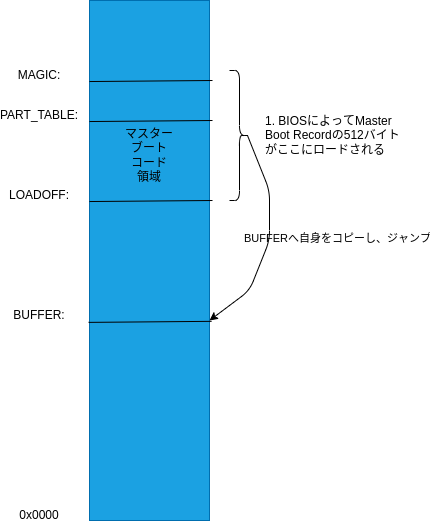

# 起動処理

## 概要

1. BOISが最初のセクターに510バイトのオフセットでマジックナンバー (0xAA55) を持つディスクを検索。
2. 該当のセクタをメモリのアドレスLOADOFFにロードし、実行。セクタの中身はインストール時に書き込まれたマスターブートブロックコード (masterboot.s)である。
3. マスターブートブロックコードはコード自身をBUFFERにコピーし、コピー先にジャンプする。`fix`変数 (installbootユーティリティでパッチされている) によって指定されたパーティション、またたパーティションテーブル(パーティションテーブルはディスクの最初のセクターに書き込まれている)を検索してアクティブパーティションを見つけて、最初のセクタを読み込む。読み込まれるのは通常はブートストラップコード (bootblock.s)。
4. ブートストラップもアドレスLOADOFFにロードされるが、 マスターブートブロックとは違って自身をコピーしない。ブートストラップは、ブートモニタコードをBOOTSEGにロードし、BOOTSEG:BOOTOFFに(つまり、ヘッダーをスキップし)ジャンプ。ブートモニタは4つのファイル(boothead.s、boot.c、bootimage.c、rawfs.c)から構成される。
6. ブートストラップがブートモニターにジャンプした直後に、boothead.sのコードが実行される。メモリレイアウト、プロセッサ(286, 386, 486など)、現在のビデオモード、ブートされたデバイスを決定し、最後に`boot()`(boot.c)を呼び出す。Minix OSにジャンプする (必要に応じてリアルモードからプロテクトモードに切り替える) 機能もboothead.sにある。
7. `boot()`は`initialize()`(同様にboot.cにある)をコールする。`initialize()`はブートモニターを再配置し、カーネルに渡されるメモリマップからブートモニターを削除します (カーネルがブートモニターを上書きしないようにします) 。`initialize()`は、次の2つの関数を呼び出す。
   1. `get_parameters()`(boot.cにある)は、いくつかの環境変数や関数を設定し、bootparamsセクタ (アクティブなパーティションの2番目のセクタ) からいくつかのパラメータの値を取得する。
   2. `r_super()`(rawfs.cで見つかる)は、システムがminixファイルシステムであることを検証し、ファイルシステムのパラメータを決定する。
8. これら2つの関数から戻ると、ブートモニターはユーザーが入力したコマンドを実行する。最も重要なコマンドはboot (システムをブートする)であり、`bootminix()`(bootimage.cにある)を呼び出す。
9.  `bootminix()`は以下の関数を呼び出す。
    1.  `select_image()`は、ディスク上の目的のOSイメージを検索する。
    2.  `exec_image()`は、OSイメージをメモリにロードする。
    3.  `minix()`(boothead.sで見つかる)はプロテクトモードに切り替え (カーネルがプロテクトモード向けにコンパイルされている場合) 、カーネルにジャンプする。
10. `bootminix()`は、OSからブートモニターに戻ると(たとえば、ユーザーがminix shutdownコマンドを発行した場合に)復帰する。

rawfs.cは、ファイルシステム操作の小さなサブセットである。たとえば、ディスクからブロックを読み取ったり、ファイルに関する情報を見つけたり、ディレクトリの内容を読み取ったり、パス名をiノード番号に変換したりできる。

## masterboot.s



のように、起動ディスクの最初のセクタをLOADOFFアドレスにロードし実行する。マスターブートブロックコードは自身をBUFFER領域にコピーする。アドレスの定義は以下

```Unix Assembly
	LOADOFF	   =	0x7C00	! 0x0000:LOADOFF is where this code is loaded
	BUFFER	   =	0x0600	! First free memory
	PART_TABLE =	   446	! Location of partition table within this code
	PENTRYSIZE =	    16	! Size of one partition table entry
	MAGIC	   =	   510	! Location of the AA55 magic number
```

これから、コードを見ていきます。

```Unix Assembly
! Find active (sub)partition, load its first sector, run it.

master:
	xor	ax, ax
	mov	ds, ax
	mov	es, ax
```

第1オペランドのレジスタ(ax)と第2オペランド(ax)とで排他的論理和をとって、第1オペランド(ax)に結果を格納します。自分自身(ax)と排他的論理和は必ずゼロになるので、axレジスタをゼロにします (それ自身とxorされた数字はすべて0です) 。これはかなり一般的なテクニックです。

```
mov ax,#0
```

だと、xorの2バイトに比べて遅く、3バイトを消費する機械語になってしまう。その後、ds, esのセグメントレジスタを0にします。

```
	cli
	mov	ss, ax			! ds = es = ss = Vector segment
	mov	sp, #LOADOFF
	sti
```

スタックセグメントレジスタ (ss) またはスタックポインター (sp) に値をmovする場合は、最初に割り込みを無効にする必要がある。ssおよびspレジスタは、割り込みが完了した後に戻るアドレスを保持する。もしssレジスタとspレジスタが変動している間に割り込まれた場合、コードが戻る場所は不定である。
割り込みはcli (clear interrupts) 命令で無効になり、sti (set interrupts) 命令で再度有効になる。

```
! Copy this code to safety, then jump to it.
	mov	si, sp			! si = start of this code
	push	si			! Also where we'll return to eventually
	mov	di, #BUFFER		! Buffer area
	mov	cx, #512/2		! One sector
	cld
  rep	movs
```

この部分は、前述の図のように、LOADOFFから512バイトをBUFFER領域にコピーします。
rep movs命令は、cxワードをds:si(これは0:LOADOFF)からes:di(これは0:BUFFER)に移動する。起動直後のシステムは16ビットPCとして(リアルモードで)起動するので1ワードは2バイトになっている。このため512/2ワードを移動する必要がある。

cld (clear direction flag) は、rep movs命令が0:LOADOFFから0:LOADFF-512までのバイトではなく、0:LOADOFFから0:LOADOFF+512までのバイトをコピーすることを指定する。前者が必要な場合は、cldの代わりにstd (set direction flag) を使用する。

```
	jmpf	BUFFER+migrate, 0	! To safety
migrate:
```

jmpf(far jump)は、セグメント0、オフセットBUFFER+migrateにジャンプする。よって、コピー先の領域にある、次の命令にジャンプすることになる。

```
findactive:
	testb	dl, dl
	jns	nextdisk		! No bootable partitions on floppies
```

BIOSは起動時にDLレジスタに起動ドライブの番号を設定する。0x00と0x01は1台目と2台目のフロッピードライブに対応し、0x80、0x81、0x82、0x83はハードディスクドライブ1~4に対応する。
testbはdl自身のビット単位の論理積をとり、signフラグを変更(負の場合に1)します。負でない場合(つまりフロッピードライブ)の場合、nextdiskへジャンプする。

```
	mov	si, #BUFFER+PART_TABLE
find:	cmpb	sysind(si), #0		! Partition type, nonzero when in use
	jz	nextpart
	testb	bootind(si), #0x80	! Active partition flag in bit 7
	jz	nextpart		! It's not active
```

パーティションテーブル(#BUFFER+PART_TABLE)を読み込んでチェックしていく。
si+sysindの値が0の場合、もしくはsi+bootindの7ビット目が立っていなければ、次のパーティションのチェックにジャンプする。

パーティションテーブルのエントリの構造は以下のようになっています。

```Unix Assembly
	! <ibm/partition>.h:
	bootind	   =	     0
	sysind	   =	     4
	lowsec	   =	     8
```


```
loadpart:
	call	load			! Load partition bootstrap
	jc	error1			! Not supposed to fail
bootstrap:
	ret				! Jump to the master bootstrap
```

loadを呼び出して、アクティブパーティションの最初のセクタを読み込みます。

```
load:
	mov	di, #3		! Three retries for floppy spinup
retry:	push	dx		! Save drive code
	push	es
	push	di		! Next call destroys es and di
	movb	ah, #0x08	! Code for drive parameters
	int	0x13
	pop	di
	pop	es
```

[ah=0x08にセットしてint 0x13を呼び出す](https://en.wikipedia.org/wiki/INT_13H#INT_13h_AH=08h:_Read_Drive_Parameters)と、dlに指定したドライブのパラメータを返す。
バグのあるBIOSは、ES:DIを0x0000:0x0000にセットしてしまうので、es, diを予めスタックに退避して、呼び出し後に復元する。

```
	andb	cl, #0x3F	! cl = max sector number (1-origin)
	incb	dh		! dh = 1 + max head number (0-origin)
	movb	al, cl		! al = cl = sectors per track
	mulb	dh		! dh = heads, ax = heads * sectors
	mov	bx, ax		! bx = sectors per cylinder = heads * sectors
	mov	ax, lowsec+0(si)
	mov	dx, lowsec+2(si)! dx:ax = sector within drive
	cmp	dx, #[1024*255*63-255]>>16  ! Near 8G limit?
	jae	bigdisk
```

int 0x13呼び出しの結果は以下のようにレジスタがセットされる。clの5:0ビットにトラックあたりのシリンダ数、dhにヘッダの最大インデックス(0開始)がセットされる。bxにシリンダあたりのセクタ数を計算しておきます。

結果

| レジスタ | 設定値 |
| --- | --- |
| CF | エラー時にON |
| AH | 戻り値 | 
| DL | ディスクのドライブ番号 |
| DH | ヘッドの最大インデックス(0開始)  |
| CX | [7:6] [15:8] シリンダの最大インデックス(0開始)<br />[5:0] セクタ数(1開始) |
| BL | ドライブのタイプ(AT/PS2フロッピーのみ) | 
| ES:DI | ドライブパラメータ・テーブルへのポインタ(フロッピーのみ) |

dxの値で、開始位置が8GBを超えていないかをチェックして、超えていた場合はbigdiskの処理を実行する。


```
	div	bx		! ax = cylinder, dx = sector within cylinder
	xchg	ax, dx		! ax = sector within cylinder, dx = cylinder
	movb	ch, dl		! ch = low 8 bits of cylinder
	divb	cl		! al = head, ah = sector (0-origin)
	xorb	dl, dl		! About to shift bits 8-9 of cylinder into dl
	shr	dx, #1
	shr	dx, #1		! dl[6..7] = high cylinder
	orb	dl, ah		! dl[0..5] = sector (0-origin)
	movb	cl, dl		! cl[0..5] = sector, cl[6..7] = high cyl
	incb	cl		! cl[0..5] = sector (1-origin)
	pop	dx		! Restore drive code in dl
	movb	dh, al		! dh = al = head
	mov	bx, #LOADOFF	! es:bx = where sector is loaded
	mov	ax, #0x0201	! Code for read, just one sector
	int	0x13		! Call the BIOS for a read
	jmp	rdeval		! Evaluate read result
```

以下のパラメータを計算して、[ah=0x02にセットしてint 0x13を呼び出し](https://en.wikipedia.org/wiki/INT_13H#INT_13h_AH=02h:_Read_Sectors_From_Drive)て、アクティブパーティションの最初のセクタをロードする。ロード後はrdevalにジャンプして、処理を続ける。

パラメータ

| レジスタ | 設定値 |
| --- | --- |
| AL | 読み込むセクタ数 |
| CH | シリンダ番号 |
| CL | セクタ番号 |
| DH | ヘッドのインデックス |
| DL | ドライブ | 
| ES:BX | 読み出し先アドレス |

結果

| レジスタ | 設定値 |
| --- | --- |
| CF | エラー時にON |
| AH | 戻り値 | 
| AL | 実際に読み込んだセクタ数 | 

(bigdisk:は省略)

```
rdeval:
	jnc	rdok		! Read succeeded
```

エラーがなければCFフラグはクリアされてるので、エラーがなければrdokへジャンプ

```
rdok:	cmp	LOADOFF+MAGIC, #0xAA55
	jne	nosig		! Error if signature wrong
	ret			! Return with carry still clear
```

ロードしたセクタにマジックナンバーがセットされていれば、retで戻っていくことでロードしたブートストラップコード(bootblock.s)に処理を移す。

## bootblock.s

このファイルには、最終的にフロッピーディスクまたはハードディスクパーティションから読み取られるコードが含まれている。それは、ブートデバイスから/boot/bootをアドレス0x10000のメモリにロードし、それを実行するのに十分な賢さがあるだけである。/boot/bootのディスクアドレスは、installbootによって24ビットのセクター番号と、enddataより大きな8ビットのセクタ数としてこのコードにパッチされる。/boot/bootは、Minixカーネルのさまざまな部分をメモリにロードして実行し、最終的にMinixを起動するために十分に賢い。

このコードがハードドライブから始まり、マスターブートコードがこのコードを読み込んだ場合は、ブートパーティションに対応するパーティションテーブルエントリがes:siに渡される。

```
boot:
	xor	ax, ax		! ax = 0x0000, the vector segment
	mov	ds, ax
	cli			! Ignore interrupts while setting stack
	mov	ss, ax		! ss = ds = vector segment
	mov	sp, #LOADOFF	! Usual place for a bootstrap stack
	sti
```

(masterboot.sと同様に)axレジスタを0にセットし、ds, ssも0に設定する。スタックは#LOADOFFより下位に配置される。(コードよりも下位アドレスってのはちょっと馴染みがない)

```
	push	ax
	push	ax		! Push a zero lowsec(bp)

	push	dx		! Boot device in dl will be device(bp)
	mov	bp, sp		! Using var(bp) is one byte cheaper then var.
```

6バイト分だけスタック領域を確保して、変数(bp)によるアドレスでアクセスできるようにしている。用途は以下の通り。

```
	! Variables addressed using bp register
	device	   =	     0	! The boot device
	lowsec	   =	     2	! Offset of boot partition within drive
	secpcyl	   =	     6	! Sectors per cylinder = heads * sectors
```

全部で8バイト必要なのだが、6バイトしか確保しなかったので、最初の命令`xor	ax, ax`のコードが上書きされてしまう。だが、この命令は二度と実行されないので問題にはならない。まだコードセクションとかを指定していないので、コード領域に書き込んでもエラーにならない。

```
	push	es
	push	si		! es:si = partition table entry if hard disk
```

masterboot.sで設定されたパーティションテーブルのエントリのアドレスを退避。

```
	mov	di, #LOADOFF+sectors	! char *di = sectors;
```

diレジスタに、sectorデータ用のポインタをセット。(ハードディスク起動の場合、参照先のデータは後で書き換えられる)

```
	testb	dl, dl		! Winchester disks if dl >= 0x80
	jge	floppy
```

masterboot.sと同様にフロッピーからの起動かをチェックして分岐。

```
winchester:

! Get the offset of the first sector of the boot partition from the partition
! table.  The table is found at es:si, the lowsec parameter at offset LOWSEC.

	eseg
	les	ax, LOWSEC(si)	  ! es:ax = LOWSEC+2(si):LOWSEC(si)
	mov	lowsec+0(bp), ax  ! Low 16 bits of partition's first sector
	mov	lowsec+2(bp), es  ! High 16 bits of partition's first sector
```

(si)にパーティションテーブルのエントリがある。そこからLOWSECオフセットの位置にパーティションの開始アドレスがあるのでax、esレジスタに読み込む。読み込んだ値をスタックに保存する。

結局のところ、以下のようにパーティションテーブルのエントリの一部をスタックにコピーしている。


```
	movb	ah, #0x08	! Code for drive parameters
	int	0x13		! dl still contains drive
	andb	cl, #0x3F	! cl = max sector number (1-origin)
	movb	(di), cl	! Number of sectors per track
	incb	dh		! dh = 1 + max head number (0-origin)
	jmp	loadboot
```

masterboot.sと同様にディスク情報を取得。

```
loadboot:
! Load /boot from the boot device

	movb	al, (di)	! al = (di) = sectors per track
	mulb	dh		! dh = heads, ax = heads * sectors
	mov	secpcyl(bp), ax	! Sectors per cylinder = heads * sectors
```

セクタ数/シリンダを計算し、secpcyl(bp)に保存

```
	mov	ax, #BOOTSEG	! Segment to load /boot into
	mov	es, ax
	xor	bx, bx		! Load first sector at es:bx = BOOTSEG:0x0000
```

bootプログラムの読み出し先を設定。

```
	mov	si, #LOADOFF+addresses	! Start of the boot code addresses
```

installbootユーティリティによって設定される値のアドレスをセット。

```
load:
	mov	ax, 1(si)	! Get next sector number: low 16 bits
	movb	dl, 3(si)	! Bits 16-23 for your up to 8GB partition
	xorb	dh, dh		! dx:ax = sector within partition
```

bootプログラムはディスク上に分割して格納されている。addressesは、分割の単位毎にセクタ数(1バイト)、パーティション内での開始セクタ(3バイト)の4バイトのエントリがが作成される。ここでは、開始セクタをdx:axとして取得している。

```
	add	ax, lowsec+0(bp)
	adc	dx, lowsec+2(bp)! dx:ax = sector within drive
	cmp	dx, #[1024*255*63-255]>>16  ! Near 8G limit?
	jae	bigdisk
```

lowsecの情報を使って、開始セクタをパーティション内からディスクの先頭する。(8GB以上の大容量ディスクのチェックもしている)

```
	div	secpcyl(bp)	! ax = cylinder, dx = sector within cylinder
	xchg	ax, dx		! ax = sector within cylinder, dx = cylinder
	movb	ch, dl		! ch = low 8 bits of cylinder
	divb	(di)		! al = head, ah = sector (0-origin)
	xorb	dl, dl		! About to shift bits 8-9 of cylinder into dl
	shr	dx, #1
	shr	dx, #1		! dl[6..7] = high cylinder
	orb	dl, ah		! dl[0..5] = sector (0-origin)
	movb	cl, dl		! cl[0..5] = sector, cl[6..7] = high cyl
	incb	cl		! cl[0..5] = sector (1-origin)
	movb	dh, al		! dh = al = head
	movb	dl, device(bp)	! dl = device to read
	movb	al, (di)	! Sectors per track - Sector number (0-origin)
	subb	al, ah		! = Sectors left on this track
	cmpb	al, (si)	! Compare with # sectors to read
	jbe	read		! Can't read past the end of a cylinder?
	movb	al, (si)	! (si) < sectors left on this track
```

int 13呼び出しのためのパラメータを計算。トラックの最後まで読み出す必要がない場合は、(si)のセクタ数文だけ読み出す。

```
read:	push	ax		! Save al = sectors to read
	movb	ah, #0x02	! Code for disk read (all registers in use now!)
	int	0x13		! Call the BIOS for a read
	pop	cx		! Restore al in cl
	jmp	rdeval
! 略
rdeval:
	jc	error		! Jump on disk read error
	movb	al, cl		! Restore al = sectors read
	addb	bh, al		! bx += 2 * al * 256 (add bytes read)
	addb	bh, al		! es:bx = where next sector must be read
	add	1(si), ax	! Update address by sectors read
	adcb	3(si), ah	! Don't forget bits 16-23 (add ah = 0)
	subb	(si), al	! Decrement sector count by sectors read
	jnz	load		! Not all sectors have been read
	add	si, #4		! Next (address, count) pair
	cmpb	ah, (si)	! Done when no sectors to read
	jnz	load		! Read next chunk of /boot
```

int 13呼び出しでディスクを読む。読み出した結果でaddressesを更新し、続きがあるならloadをループする。

```
done:

! Call /boot, assuming a long a.out header (48 bytes).  The a.out header is
! usually short (32 bytes), but to be sure /boot has two entry points:
! One at offset 0 for the long, and one at offset 16 for the short header.
! Parameters passed in registers are:
!
!	dl	= Boot-device.
!	es:si	= Partition table entry if hard disk.
!
	pop	si		! Restore es:si = partition table entry
	pop	es		! dl is still loaded
	jmpf	BOOTOFF, BOOTSEG  ! jmp to sec. boot (skipping header).
```

読み込みが完了したら、es:siにパーティションテーブルのエントリをセットし直して、bootプログラムの(ヘッダ部分をスキップして)コード部分へジャンプ。
